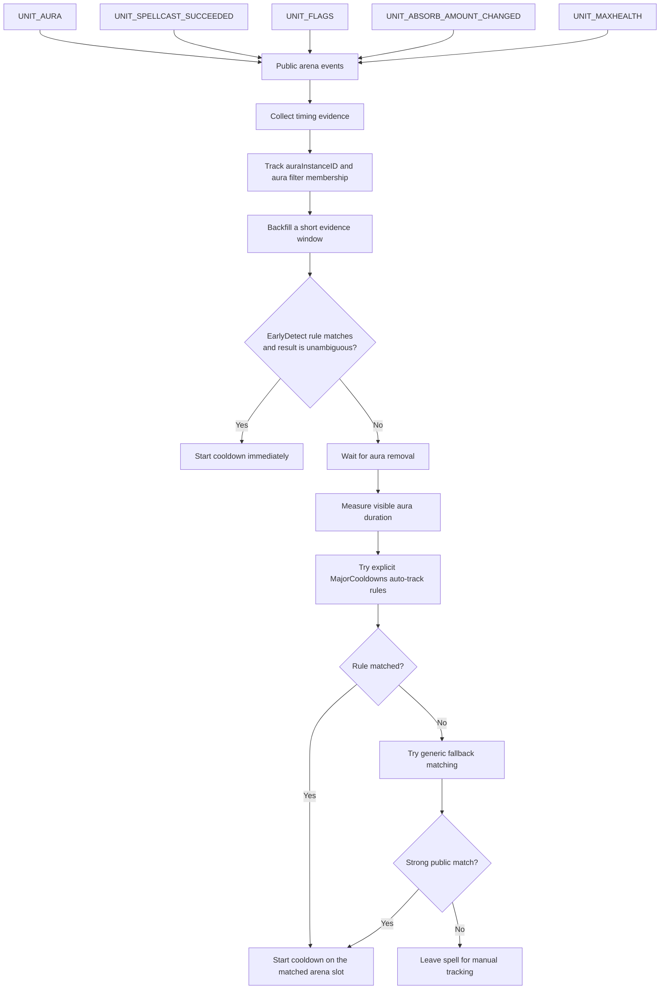

# HandyBar (Retail 12.0.1+)

HandyBar is a Retail World of Warcraft PvP arena addon for tracking enemy cooldowns with two complementary workflows:

- manual click tracking when you see an ability used
- automatic enemy cooldown detection for many public and visible cooldown signals

Version: `1.3.1`

Saved variables: `HandyBarDB`

Embedded libraries: `Ace3` + `MajorCooldowns`

## What HandyBar Does

HandyBar builds spell bars that appear in arena and only show cooldowns relevant to the enemy team you are facing.

Out of the box it:

- creates two default bars: `Defensives` and `Offensives`
- detects enemy class/spec information from the arena prep API
- filters icons to the classes/specs currently present in the match
- supports per-slot display targeting (`All Enemies`, `Arena 1`, `Arena 2`, `Arena 3`)
- can duplicate icons when multiple enemies share the same class/spec
- supports manual start/reset on click
- supports automatic tracking when a cooldown can be inferred from public arena data

The addon is designed as a practical arena tool, not a combat log oracle. If a spell cannot be auto-detected reliably, you can still track it manually with one click.

## Core Workflow

### 1. Arena enemy detection

HandyBar primarily uses:

- `ARENA_PREP_OPPONENT_SPECIALIZATIONS`
- `GetNumArenaOpponentSpecs()`
- `GetArenaOpponentSpec(i)`
- `GetSpecializationInfoByID(specID)`

If prep data is missing or incomplete, it falls back to `UnitClass("arenaX")` and preserves the best-known slot/spec mapping as the arena updates.

This lets HandyBar:

- show only spells relevant to the enemy comp
- assign duplicated spell icons to specific arena slots
- keep spec-specific tracking stable during `ARENA_OPPONENT_UPDATE`

### 2. Manual tracking

Manual tracking is always available on visible icons:

- `Left-click`: start the cooldown
- `Right-click`: reset the cooldown

If an icon is slot-assigned, the click affects that enemy slot only. When duplicate mode is enabled, the top-left badge on the icon shows the arena slot number.

### 3. Automatic tracking

When `Automatic Enemy Cooldown Detection` is enabled, HandyBar listens to public arena signals such as:

- `UNIT_AURA`
- `UNIT_SPELLCAST_SUCCEEDED`
- `UNIT_FLAGS`
- `UNIT_ABSORB_AMOUNT_CHANGED`
- Blizzard aura filters:
  - `HELPFUL|BIG_DEFENSIVE`
  - `HELPFUL|EXTERNAL_DEFENSIVE`
  - `HELPFUL|IMPORTANT`

The detection pipeline is built to be compatible with Midnight-era restrictions:

- no secret aura field comparisons
- no direct dependence on hidden `spellId`, `duration`, or `expirationTime`
- matching based on public aura instance IDs, aura filter membership, timing evidence, slot/spec matching, and known spell metadata

HandyBar uses both:

- explicit auto-track rules supplied by `MajorCooldowns`
- a generic fallback matcher for visible buffs whose public aura duration and category strongly match a known cooldown

Automatic tracking is intentionally best-effort. Spells with no visible/public aura or ambiguous evidence may still require manual clicks.

#### Auto-Tracking Flow

The auto-tracker follows this public-data pipeline:

Notes:

- `EarlyDetect` allows HandyBar to start long offensive or defensive buffs at aura appearance time instead of waiting for the buff to expire.
- The matching stays Midnight-safe by relying on public aura instance IDs, public aura categories, slot/spec filtering, and short timing windows rather than secret aura fields.

## Features

- Arena-only runtime display, with `Test Mode` for setup outside arena
- Draggable, lockable bars with saved positions
- Adjustable icon size, spacing, growth direction, wrapping, and display limits
- Optional cooldown text with urgency coloring
- Optional class-colored icon borders
- Charge support for multi-charge spells
- Global cooldown duration overrides
- Custom spell registration by Spell ID
- Automatic tooltip-based cooldown extraction for custom spells
- Optional icon tooltips
- Optional debug logging
- AceDB profile support
- English and French localization

## Installation

Install the addon in:

`World of Warcraft/_retail_/Interface/AddOns/HandyBar/`

Then reload the UI with `/reload` or restart the game.

## Quick Start

1. Open the addon with `/hb`.
2. Enable `Test Mode`.
3. Unlock the bars and move them where you want.
4. Go to `Bars -> <Bar Name> -> Spells` and enable the spells you want.
5. Optionally enable `Automatic Enemy Cooldown Detection` in `General`.
6. Enter arena and verify that the bars only show spells relevant to the enemy team.

On first run, HandyBar creates:

- `Defensives`
- `Offensives`

You can keep those, edit them, or create your own bars.

## Options Overview

### General

The `General` tab includes:

- `Test Mode`
- `Automatic Enemy Cooldown Detection`
- `Show Only Auto-Trackable Spells`
- `Lock Bars`
- `Icon Tooltips`
- `Debug Mode`
- `Reset All Cooldowns`
- `Reset Configuration`

Important behavior:

- `Test Mode` is runtime-only
- `Test Mode` is automatically disabled on reloads, zone changes, and real arena entry
- `Show Only Auto-Trackable Spells` filters both the spell selection UI and visible runtime icons to only spells the auto-tracker can handle

### Bars

You can create any number of custom bars. Each bar has three sections:

#### Appearance

Per-bar appearance options:

- enabled/disabled
- icon size
- spacing
- `Max Icons Per Row`
- `Icon Display Limit`
- growth direction
- cooldown text
- class border
- reset cooldowns for that bar
- reset position
- delete bar

#### Arena Visibility

Per-bar visibility options:

- `All Enemies`
- `Arena 1 Only`
- `Arena 2 Only`
- `Arena 3 Only`
- `Duplicate Same Spec/Class`

`Duplicate Same Spec/Class` is useful when multiple opponents share the same class or spec. With duplication enabled, HandyBar can render separate slot-aware icons instead of a single shared icon.

#### Spells

Each bar gets a class-organized spell picker powered by `MajorCooldowns`.

The spell UI supports:

- class groups
- spec buckets such as `All Specs`, single-spec groups, and `Multiple Specs`
- `Enable Default`
- `Disable All`
- tooltip summaries with cooldown, category, spell ID, and override state

### Customize

The `Customize` tab contains two tools:

#### Cooldown Overrides

Override the duration of any registered spell globally. Once enabled for a spell, the custom duration is used in:

- tooltips
- manual tracking
- automatic tracking display
- all bars using that spell

#### Custom Spells

Register your own spells by Spell ID with:

- class
- optional specialization
- category
- cooldown duration

The form also supports:

- previewing spell name and icon
- auto-switching into edit mode if the spell already exists
- automatic cooldown detection from the spell tooltip
- editing and removing existing custom entries

Custom spells are loaded into the internal `MajorCooldowns` registry during addon initialization and can be enabled per bar like any other spell.

### Profiles

HandyBar uses `AceDB-3.0` profiles. A `Profiles` panel is registered under the addon options so you can copy, reset, or swap configurations between characters and specializations.

## Match Behavior

During actual arena play, HandyBar follows a few important rules:

- entering arena resets active cooldowns and refreshes enemy detection
- leaving arena clears arena enemy state
- bars are hidden outside arena unless `Test Mode` is active
- dead or ghost enemy arena units are ignored by the auto-tracker
- automatic tracking avoids duplicate starts when the same event is seen multiple times in a short window
- if bars need to rebuild because enemy info changes, active cooldown state is preserved when possible

## Slash Commands

- `/hb`
- `/handybar`
- `/hb test`
- `/hb lock`
- `/hb reset`

Behavior:

- `/hb` opens the options
- `/hb test` toggles Test Mode
- `/hb lock` toggles bar locking
- `/hb reset` resets all active cooldowns

## Troubleshooting

### No icons appear in arena

Check:

1. The bar is enabled.
2. The relevant spells are enabled on that bar.
3. The bar is not filtered to a different arena slot.
4. The enemy team actually contains the matching class/spec.
5. `Show Only Auto-Trackable Spells` is not hiding manual-only entries.

### No icons appear outside arena

That is expected unless `Test Mode` is enabled.

### Automatic tracking misses some spells

That is expected for some abilities. Auto-tracking only works when HandyBar can infer a cooldown from public arena evidence. Hidden, aura-less, or ambiguous spells may still require manual clicks.

If you want to inspect what the tracker is doing:

1. Enable `Debug Mode`.
2. Enter arena.
3. Watch the chat output for messages such as:
   - `Tracking aura ...`
   - `Generic match ...`
   - `Auto-detected ...`
   - `No rule match ...`

### Test Mode turned itself off

This is intentional. Test Mode never persists through:

- reloads
- zone changes
- entering a real arena

## File Layout

- `HandyBar.toc`: addon metadata and load order
- `Core.lua`: addon setup, saved variables, slash commands, shared helpers, custom spell registration
- `Modules/Bar.lua`: bar creation, button pooling, layout, timers, charge handling, click behavior
- `Modules/Arena.lua`: arena detection, class/spec mapping, slot matching
- `Modules/EnemyCooldowns.lua`: automatic enemy cooldown detection
- `Modules/TestMode.lua`: runtime-only test mode
- `Options.lua`: AceConfig options UI
- `Locale/enUS.lua`: English strings
- `Locale/frFR.lua`: French strings

## Notes

HandyBar ships with embedded `Ace3` and `MajorCooldowns` libraries in `Libs/`.

The addon is strongest when used as a hybrid tracker:

- automatic tracking for visible/public enemy cooldowns
- manual clicks for anything the game does not expose clearly enough

That combination keeps the addon useful even when API visibility changes or a specific spell cannot be auto-detected safely.
